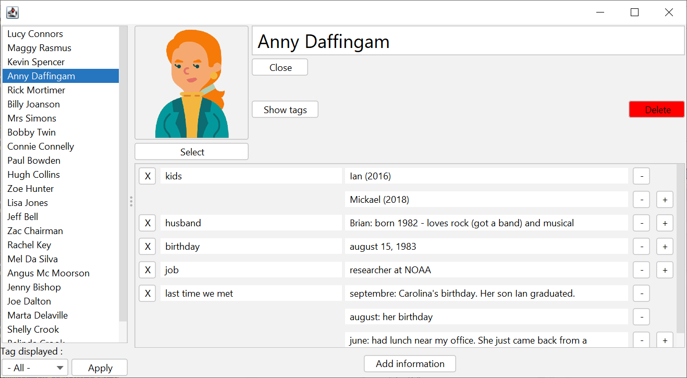

# WAYA

WAYA, a software with a graphical interface to help you remember things on people you like.

## Description

WAYA is made to help you keep information on people you know: friends, family, colleagues. Use WAYA's graphical interface to create and update notes on people.

## Getting Started

### Requirements

- Java 8

### Installing

1. Create a WAYA directory somewhere with write access
2. Download waya.jar and copy it to the WAYA directory

### Executing

__Windows__

From the graphical interface: 

- double click on the "waya" jar.

From the command line: 

- run `java -jar waya.jar`

## Author

**Bertrand Gazanion** - [bgazanion](https://github.com/bgazanion)

## License

This project is licensed under the Apache version 2.0 License - see the LICENSE.md file for details.

The following bundled third-party jars are distributed under the Apache version 2.0 license:
- FlatLaf 1.6.4 - [www.formdev.com](https://www.formdev.com/flatlaf) - by FormDev Software GmbH
- Genson 1.6 - [genson.io](http://genson.io) - by Eugen Cepoi

The images from the example are from the [professional icons](https://www.flaticon.com/free-icons/professional) created by [ultimatearm](https://www.flaticon.com/authors/ultimatearm) on Flaticon.

## Acknowledgement

- Rob Camick for the ScrollablePanel class published on [tips4java.wordpress.com](https://tips4java.wordpress.com)
